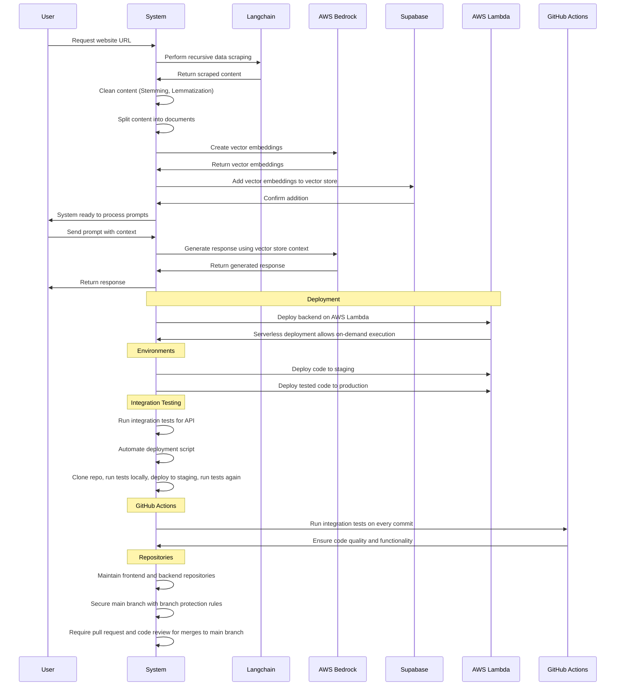

<div align="center">
<a href="">

</a>
</div>
</br>
<div>
<div align="center">


<br/>
<br/>

</div>

</div align="left" >

## About Web Wizard

**Webs Wizard** is an innovative AI chatbot meticulously designed to enhance website interactions. Trained on user-provided links, this advanced chatbot seamlessly integrates with websites, delivering instant responses and boosting user engagement. It expedites interactions by eliminating time-consuming searches, significantly improving operational efficiency.
</br>

## Features

- **Tailored Data Training:** Our chatbot receives specialized training from provided web pages, nurturing a vast knowledge base for LLM model proficiency.
- **Enhanced Knowledge Base:** Ingest website content into a searchable knowledge base to ensure a robust reference source for chatbot training, enabling accurate and contextually relevant responses.
- **Instantaneous Responses:** The chatbot promptly addresses user queries regarding website content, eliminating the need for human intervention and significantly reducing user wait time.
- **Effortless Integration:** Easily embed the chatbot directly onto any website using HTML iframe embedding, with advanced customization options and theming to enrich user satisfaction and engagement.
- **Responsive and Efficient Design:** Implemented as an end-to-end solution that works on multiple screen sizes with the help of Tailwind CSS, enabling users to efficiently accomplish tasks without navigating multiple pages.
  </br>

_WebsiteWizard aims to deliver an intuitive and effective solution for crafting, personalizing, and launching AI-driven chatbots, ultimately elevating user engagement and satisfaction across various domains and industries._

<h1> Try WebWizard</h1>

<!--`Link to install`
Screenshot of landing page
-->
## 💡 How Web Wizard works ?



>This sequence diagram depicts the interaction flow within a system handling website data processing and AI-driven response generation. Initially, the system scrapes data recursively from the requested URL, cleans it, and generates vector embeddings using Supabase. These embeddings are stored in Supabase. Upon receiving prompts from users, the system leverages these stored embeddings to generate contextually relevant responses via Amazon Bedrock. Deployment on AWS Lambda allows for scalable serverless execution, with staging and production environments ensuring smooth integration through automated testing and GitHub Actions. Authentication is handled using Supabase Auth.

<!-- GETTING STARTED -->
## Contributing

### Built Over 

- Clone the repository

   ```sh
   git clone https://github.com/your_username_/Project-Name.git
   ```

- Install dependencies

   ```sh
   npm install
   ```


### :octocat: Statistics

![Love](https://img.shields.io/badge/Made_with_Love-pink?style=flat-square&logo=data:image/svg%2bxml;base64,PHN2ZyByb2xlPSJpbWciIHZpZXdCb3g9IjAgMCAyNCAyNCIgeG1sbnM9Imh0dHA6Ly93d3cudzMub3JnLzIwMDAvc3ZnIj48dGl0bGU+R2l0SHViIFNwb25zb3JzIGljb248L3RpdGxlPjxwYXRoIGQ9Ik0xNy42MjUgMS40OTljLTIuMzIgMC00LjM1NCAxLjIwMy01LjYyNSAzLjAzLTEuMjcxLTEuODI3LTMuMzA1LTMuMDMtNS42MjUtMy4wM0MzLjEyOSAxLjQ5OSAwIDQuMjUzIDAgOC4yNDljMCA0LjI3NSAzLjA2OCA3Ljg0NyA1LjgyOCAxMC4yMjdhMzMuMTQgMzMuMTQgMCAwIDAgNS42MTYgMy44NzZsLjAyOC4wMTcuMDA4LjAwMy0uMDAxLjAwM2MuMTYzLjA4NS4zNDIuMTI2LjUyMS4xMjUuMTc5LjAwMS4zNTgtLjA0MS41MjEtLjEyNWwtLjAwMS0uMDAzLjAwOC0uMDAzLjAyOC0uMDE3YTMzLjE0IDMzLjE0IDAgMCAwIDUuNjE2LTMuODc2QzIwLjkzMiAxNi4wOTYgMjQgMTIuNTI0IDI0IDguMjQ5YzAtMy45OTYtMy4xMjktNi43NS02LjM3NS02Ljc1em0tLjkxOSAxNS4yNzVhMzAuNzY2IDMwLjc2NiAwIDAgMS00LjcwMyAzLjMxNmwtLjAwNC0uMDAyLS4wMDQuMDAyYTMwLjk1NSAzMC45NTUgMCAwIDEtNC43MDMtMy4zMTZjLTIuNjc3LTIuMzA3LTUuMDQ3LTUuMjk4LTUuMDQ3LTguNTIzIDAtMi43NTQgMi4xMjEtNC41IDQuMTI1LTQuNSAyLjA2IDAgMy45MTQgMS40NzkgNC41NDQgMy42ODQuMTQzLjQ5NS41OTYuNzk3IDEuMDg2Ljc5Ni40OS4wMDEuOTQzLS4zMDIgMS4wODUtLjc5Ni42My0yLjIwNSAyLjQ4NC0zLjY4NCA0LjU0NC0zLjY4NCAyLjAwNCAwIDQuMTI1IDEuNzQ2IDQuMTI1IDQuNSAwIDMuMjI1LTIuMzcgNi4yMTYtNS4wNDggOC41MjN6Ii8+PC9zdmc+)
